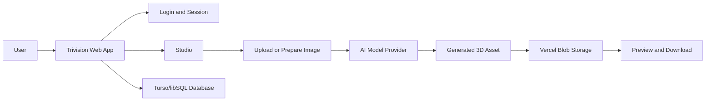

# 01. Project Overview

## What Is Trivision?

Trivision is a web application for generating 3D assets from images and prompts.

In simple words:

- The user logs in.
- The user opens the Studio.
- The user uploads an image or creates a source image from text.
- The app sends the image to an AI model.
- The AI model returns a 3D asset, usually a `.glb` file.
- The app stores the result and shows it in the browser.

It is a personal college project, mainly built to demonstrate a complete AI-powered workflow.

## Main Purpose

The project combines:

- A frontend interface
- User login
- A database
- File storage
- AI model providers
- 3D asset preview and download

This makes it more than a simple UI. It is a complete small system where data moves from the browser to backend APIs, then to AI providers, then back into the app.

## What The User Can Do

Current main features:

- Sign up and log in
- Open a dashboard
- Create or continue a generation project
- Upload a source image
- Generate a 3D asset
- Use Text to 3D source preparation
- Remove image background using RMBG
- Use MobileSAM masking for SAM 3D
- Preview the generated 3D result
- Download the generated `.glb` file
- Mark projects as favorite
- Delete or update project details

## Why This Project Is Useful For Viva

This project shows several important software engineering concepts:

- Full-stack web development
- Authentication and sessions
- Remote database usage
- Cloud file storage
- API route design
- AI model integration
- Async job polling
- Dynamic model parameters
- Error handling and retry-friendly architecture
- Deployment on Vercel

## Very Simple Explanation

You can explain it like this:

> Trivision is a Next.js web app that lets a user generate 3D assets from images. It stores user data and generation history in a Turso/libSQL database, stores uploaded and generated files in Vercel Blob, and connects to AI model providers like Runware and a self-hosted Lightning AI TRELLIS server. The app supports dynamic model parameters so new models can be added without rebuilding the whole UI.

## High-Level Flow

