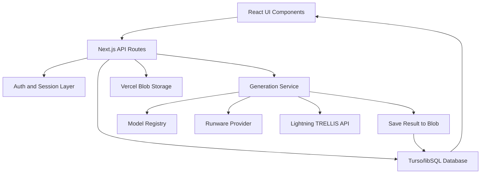

# 02. Architecture and Tech Stack

## What Is The Architecture?

Trivision uses a full-stack Next.js architecture.

This means the same project contains:

- Frontend pages and React components
- Backend API routes
- Database code
- Authentication code
- AI provider integration code
- Storage code

## Main Technologies

| Area | Technology | Why It Is Used |
| --- | --- | --- |
| Web framework | Next.js 15 App Router | Builds pages and backend API routes in one project |
| UI library | React 19 | Builds interactive components |
| Language | TypeScript | Adds type safety and catches many mistakes early |
| Styling | Tailwind CSS v4 | Theme-based styling and responsive UI |
| Icons | lucide-react | Clean consistent icons |
| 3D preview | `@google/model-viewer` | Shows `.glb` 3D models in browser |
| Browser AI helper | `onnxruntime-web` | Runs MobileSAM-related segmentation logic in browser |
| Database client | `@libsql/client` | Connects to Turso/libSQL database |
| File storage | Vercel Blob | Stores images, masks, and generated 3D files |
| Tests | Vitest | Unit tests for important logic |
| Deployment | Vercel | Hosts the Next.js app |

## Main Folder Structure

```text
app/
  pages and API routes

components/
  reusable React UI components

content/
  UI text and labels

lib/
  backend logic, database, auth, storage, AI providers

docs/
  project explanation notes
```

## Important Backend Folders

```text
lib/db/
  Database connection, schema setup, queries, and types

lib/auth/
  Password hashing and session cookie logic

lib/storage/
  Vercel Blob upload, download, and delete helpers

lib/generation/
  AI model registry, validation, job processing, provider adapters

lib/generation/providers/
  Provider-specific code for Runware, SAM, and Lightning TRELLIS

lib/generation/preparation/
  Text-to-image and background removal source preparation
```

## Frontend And Backend Together

The frontend does not directly call AI providers. It calls internal API routes first.

Example:

```text
Studio UI
  -> app/api/generations/route.ts
  -> lib/generation/service.ts
  -> provider adapter
  -> Runware or Lightning AI
```

This is better because:

- API keys stay on the server
- Validation happens in one place
- Database records can be created before the AI request
- Errors can be converted into friendly messages

## System Architecture Diagram



## Why Dynamic Model Parameters Matter

The app has a model registry in `lib/generation/registry.ts`.

Each model defines:

- Model id
- Provider id
- Input type
- Output format
- Prompt support
- Parameters
- Default values

Because of this, the Studio does not need a separate hardcoded form for every model. It reads the model definition and renders the correct controls dynamically.

This makes the project scalable. If a new image-to-3D model is added later, we can add a new model definition and provider adapter instead of rewriting the Studio page.

