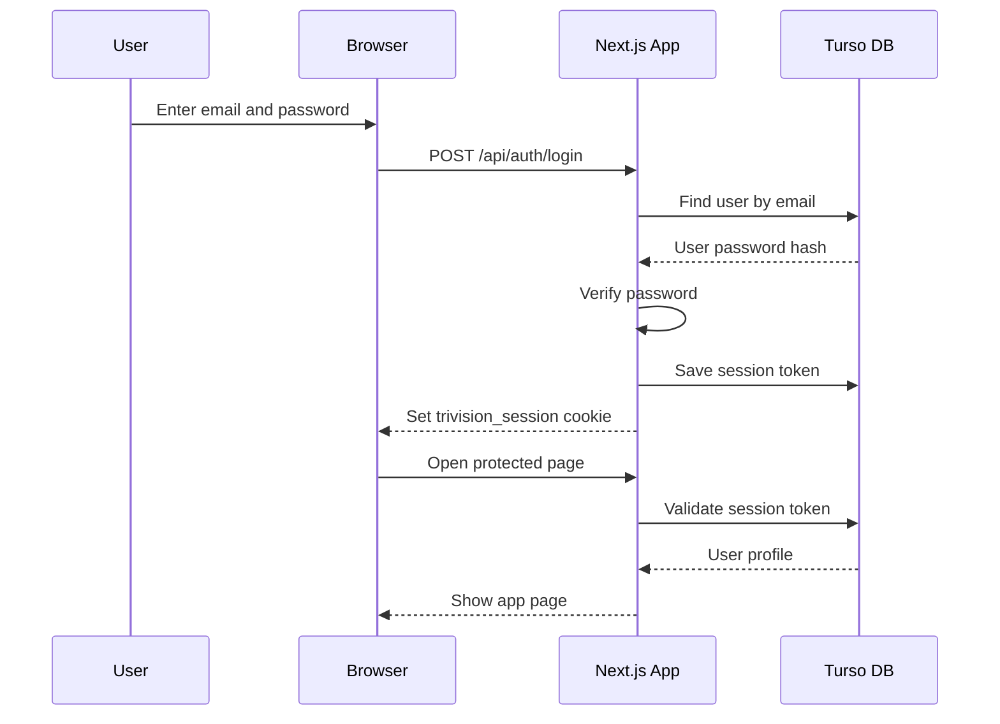
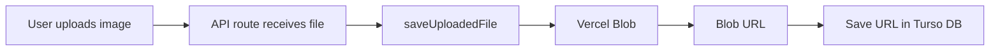

# 03. Database, Authentication, and Storage

## Database Used

Trivision uses Turso/libSQL.

Turso is a hosted database service based on libSQL, which is related to SQLite.

In simple words:

- SQLite style database
- Hosted remotely
- Works well with Vercel
- Accessed using `@libsql/client`

The app does not use a local file database anymore. It expects:

```text
DATABASE_URL
DATABASE_AUTH_TOKEN
```

## Why Remote Database Is Used

Vercel serverless functions do not keep local files permanently. A local SQLite file would not be reliable after deployment.

That is why the project uses Turso/libSQL:

- Data stays persistent
- Works from Vercel
- Easy to manage for a college project
- Similar mental model to SQLite

## Main Database Tables

| Table | Purpose |
| --- | --- |
| `users` | Stores user account details and password hash |
| `sessions` | Stores login session tokens |
| `workspaces` | Stores workspace information |
| `projects` | Stores generated asset projects and metadata |
| `generation_jobs` | Tracks AI generation jobs |
| `asset_preparation_jobs` | Tracks text-to-image and background-removal preparation jobs |
| `settings` | Stores user settings |
| `app_meta` | Stores app-level metadata like schema version |

## Authentication

The app uses custom email/password authentication.

Flow:

1. User signs up with name, email, and password.
2. Password is hashed before saving.
3. User logs in with email and password.
4. App creates a random session token.
5. Session token is saved in the database.
6. Browser receives an HTTP-only cookie named `trivision_session`.
7. Protected pages check this cookie before allowing access.

## Why Password Hashing Is Needed

The app does not store plain passwords.

Instead:

- Password is converted into a secure hash.
- The hash is stored in the database.
- During login, the entered password is hashed again and compared.

This is important because if the database is exposed, raw passwords are not directly visible.

## Session Flow Diagram



## File Storage Used

Trivision uses Vercel Blob for file storage.

It stores:

- Uploaded source images
- Generated source images from FLUX
- Background removed images from RMBG
- Mask images
- Generated `.glb` 3D files

The app expects:

```text
BLOB_READ_WRITE_TOKEN
```

## Why Blob Storage Is Used

Generated assets can be large. The database is not the right place to store image and 3D file binary data.

Instead:

- Files go to Vercel Blob.
- The database stores the file URL/path.

This keeps the database clean and makes downloads easier.

## Storage Flow



## Simple Viva Explanation

> The project uses Turso/libSQL as the database and Vercel Blob as file storage. The database stores structured data like users, sessions, projects, and generation jobs. Large files like uploaded images and generated 3D assets are stored separately in Vercel Blob, and only their URLs are saved in the database.

