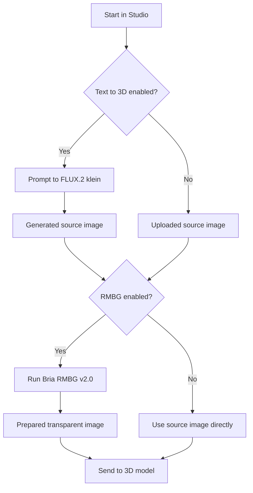
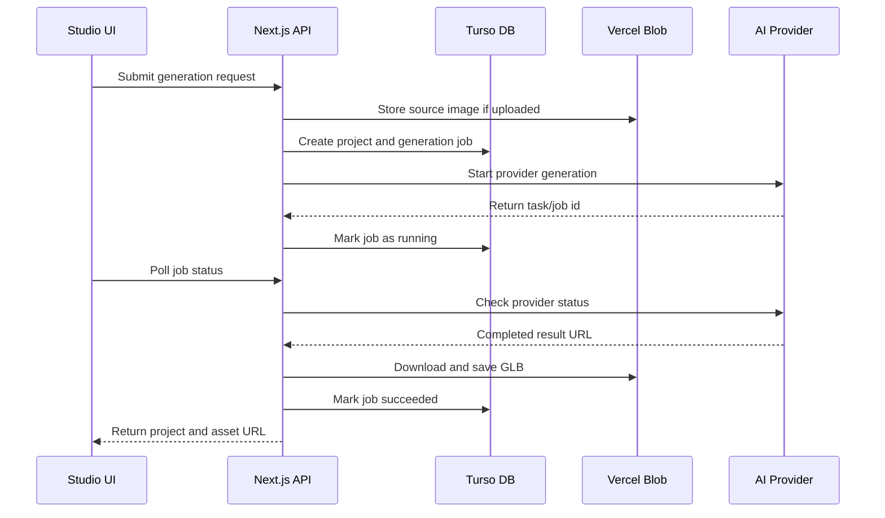
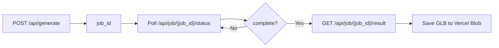

# 04. Generation Flow and AI Models

## What Is Generation?

Generation means converting user input into a 3D asset.

The input can be:

- Uploaded image
- Text prompt converted into an image first
- Image with background removed
- Image plus mask for SAM 3D

The output is usually:

- A `.glb` 3D model file

## Supported Providers

Trivision currently uses multiple provider styles.

| Provider | Purpose |
| --- | --- |
| Runware TRELLIS.2 | Image-to-3D generation |
| Runware SAM 3D Objects | Mask-guided object-to-3D generation |
| Lightning AI TRELLIS.2 | Self-hosted TRELLIS.2 API |
| Runware FLUX.2 klein | Text prompt to source image |
| Runware Bria RMBG v2.0 | Background removal |

## Model Registry

Models are defined in `lib/generation/registry.ts`.

Each model includes:

- Model id
- Provider id
- Display label
- Supported input type
- Prompt support
- Output format
- Parameters
- Default values

This is why the Studio can show different parameter panels for different models.

## Source Preparation

Source preparation happens before 3D generation.

It has two optional toggles:

1. Text to 3D
2. RMBG

### Text to 3D

If Text to 3D is enabled:

- User enters a prompt.
- App sends prompt to FLUX.2 klein.
- FLUX generates a 1024x1024 source image.
- The generated image becomes the input image for 3D generation.

### RMBG

If RMBG is enabled:

- App sends the source image to Bria RMBG v2.0.
- RMBG removes background.
- The transparent image becomes the prepared source image.

This is useful because image-to-3D models usually work better when the object is clear and separated from the background.

## Source Preparation Flow

## Normal Generation Flow

## Runware Flow

Runware models use async task IDs.

Basic idea:

1. Create a task id.
2. Submit request to Runware.
3. Store the task id in `generation_jobs`.
4. Poll Runware until complete.
5. Download the output asset.
6. Save result in Vercel Blob.
7. Update the project.

## Lightning AI TRELLIS Flow

The Lightning TRELLIS server uses its own queued API.

Flow:

1. Submit image to `POST /api/generate`.
2. Receive `job_id`.
3. Poll `GET /api/job/{job_id}/status`.
4. When status becomes `complete`, download `GET /api/job/{job_id}/result`.
5. Save the GLB to Vercel Blob.

## SAM 3D Flow

SAM 3D requires:

- Source image
- Object mask

The app uses MobileSAM-style segmentation in the browser to create a mask.

Simple explanation:

- Image shows the whole scene.
- Mask tells the AI which object to focus on.
- SAM 3D uses the image and mask to reconstruct the selected object.

## Dynamic Parameters

Different models need different parameters.

Examples:

- TRELLIS.2 has resolution, texture size, remesh, sampler settings.
- Lightning TRELLIS has pipeline type, texture size, decimation target.
- SAM 3D has fewer controls.

The app avoids hardcoding one form for all models. Instead, it reads parameter definitions from the model registry and renders controls automatically.

This is important for scalability.

If a new model is added later:

1. Add model definition to registry.
2. Add provider adapter if needed.
3. Studio can display its parameters dynamically.

