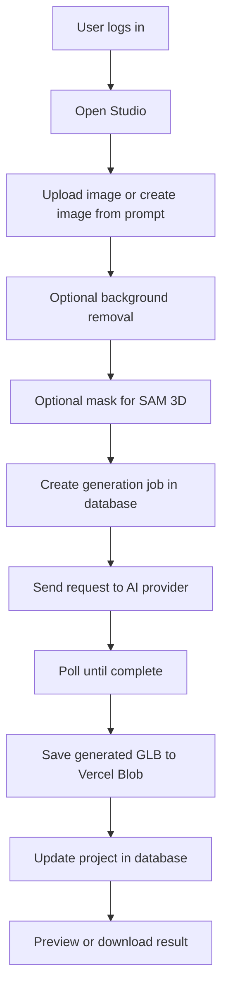

# 05. Viva Quick Notes

## One-Minute Project Explanation

Trivision is a full-stack web application that generates 3D assets from images. It is built using Next.js, React, TypeScript, and Tailwind CSS. Users can log in, upload or prepare a source image, choose an AI model, generate a 3D asset, preview it in the browser, and download the result. The app stores structured data in Turso/libSQL and stores large image or 3D files in Vercel Blob.

## What Problem Does It Solve?

Creating 3D assets manually can be slow. Trivision experiments with AI models that can convert images into 3D objects. It provides a clean web interface around those models.

## Why Did You Use Next.js?

Next.js lets us build both frontend pages and backend API routes in the same project.

In this project:

- React components build the UI.
- API routes handle login, uploads, generation, polling, and project updates.
- Server-side code safely talks to the database and AI providers.

## What Database Did You Use?

The project uses Turso/libSQL.

Simple answer:

> Turso/libSQL is a hosted SQLite-like database. I use it because the project is deployed on Vercel, and local database files are not reliable in a serverless environment.

## What Is Stored In The Database?

The database stores:

- Users
- Sessions
- Workspaces
- Projects
- Generation jobs
- Source preparation jobs
- Settings

It does not store large files directly.

## Where Are Files Stored?

Files are stored in Vercel Blob.

Examples:

- Uploaded images
- Generated source images
- Background removed images
- Masks
- Generated `.glb` files

The database only stores URLs to these files.

## How Does Login Work?

The app uses custom session-based authentication.

Steps:

1. User enters email and password.
2. Password is checked against the stored password hash.
3. App creates a random session token.
4. Token is saved in the database.
5. Browser stores token in an HTTP-only cookie.
6. Protected pages check the cookie.

## What AI Models Are Used?

The project uses:

- Runware TRELLIS.2 for image-to-3D
- Runware SAM 3D Objects for mask-guided 3D generation
- Lightning AI TRELLIS.2 as a self-hosted model API
- FLUX.2 klein for text-to-image source generation
- Bria RMBG v2.0 for background removal

## What Is Text To 3D In This Project?

Some 3D models need an image, not just text.

So the app uses a two-step process:

1. Text prompt goes to FLUX.2 klein.
2. FLUX creates an image.
3. That image is sent to the image-to-3D model.

So it is not direct text-to-3D. It is:

```text
Text -> Image -> 3D
```

## What Is RMBG?

RMBG means background removal.

It removes the background from the source image so the 3D model can focus on the object.

Flow:

```text
Image -> RMBG -> Transparent object image -> 3D model
```

## What Is MobileSAM Used For?

MobileSAM helps create a mask for the object.

A mask is like a black-and-white selection map:

- White area means object to keep.
- Black area means background to ignore.

SAM 3D uses this mask to understand which object should be converted to 3D.

## What Is A Generation Job?

A generation job is a database record that tracks the AI generation process.

It stores:

- Which model is used
- Current status
- Provider task id
- Request payload
- Response payload
- Error message if failed

Statuses include:

- queued
- running
- succeeded
- failed

## Why Polling Is Used

AI generation can take time.

The app cannot wait forever in one request. So it starts a job, saves the job id, and then the frontend checks status repeatedly.

This is called polling.

## How Would You Explain The Complete Flow?



## Important Terms To Remember

| Term | Simple Meaning |
| --- | --- |
| Frontend | What the user sees |
| Backend | Server-side logic |
| API Route | Backend endpoint inside Next.js |
| Database | Stores structured data |
| Blob Storage | Stores large files |
| Session | Keeps user logged in |
| Provider | External or self-hosted AI model service |
| Polling | Repeatedly checking job status |
| GLB | 3D model file format |
| Mask | Object selection image |
| Parameter | Model setting controlled by user |

## Strengths Of The Project

- Full-stack implementation
- Real database and file storage
- Multiple AI providers
- Dynamic model parameter system
- Background removal and text-to-image preparation
- Async job handling
- Browser-based 3D preview
- Vercel deployment ready

## Limitations You Can Honestly Mention

This is a college/personal project, so it is not a large production system.

Possible limitations:

- It is mainly designed for one account/demo usage.
- AI generation depends on external provider availability.
- Large 3D generation can take time.
- More advanced team roles or payment features are not included.

## Good Final Viva Sentence

> The main learning from this project is how to connect a modern web app with AI model providers, manage long-running generation jobs, store files and metadata properly, and present the result through a polished browser-based 3D workflow.

